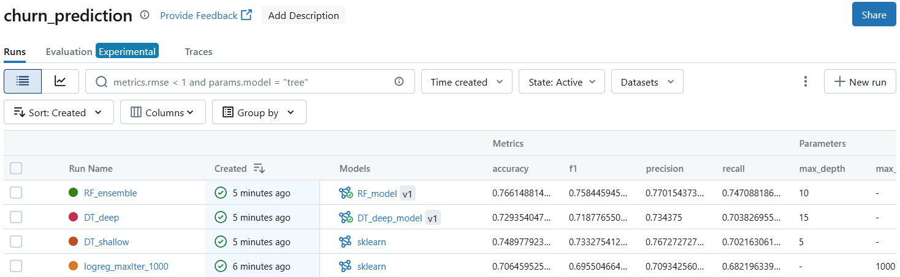
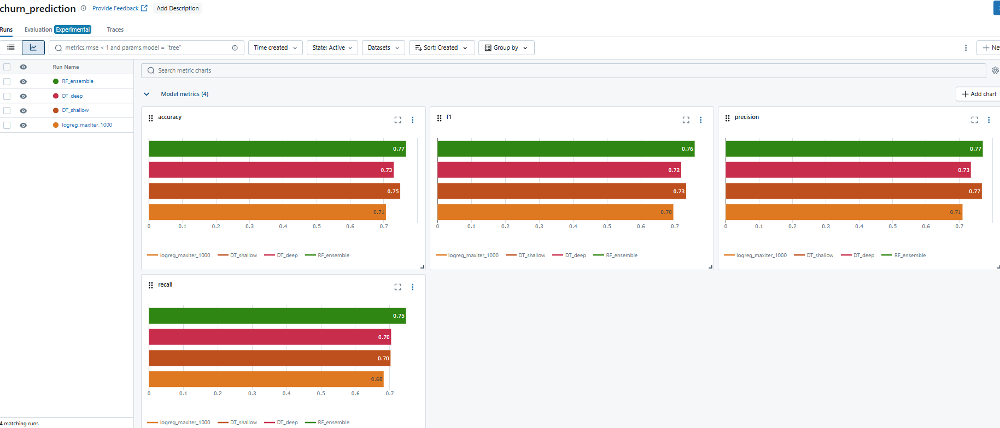
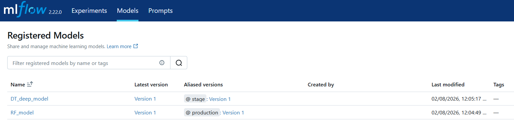

# Bank Customer Churn Prediction

Project for training and tracking machine learning experiments for predicting bank customer churn using MLflow.

Overview
- Simple preprocessing and model training examples for Logistic Regression, Decision Trees, and Random Forests.
- Uses MLflow for experiment tracking, model and artifact logging.

Getting started
1. Create and activate a Python virtual environment (recommended).

	- Windows (PowerShell):
	  ```powershell
	  python -m venv .venv
	  .\.venv\Scripts\Activate.ps1
	  pip install -r requirements.txt
	  ```

2. Start an MLflow tracking server (optional, recommended for tracking).

	```powershell
	mlflow server --backend-store-uri file://$(Resolve-Path mlruns) --default-artifact-root ./mlartifacts --host 0.0.0.0 --port 5000
	```

Running experiments
- `src/train.py` — trains a Logistic Regression model and logs artifacts (keeps original file and comments).
- `src/train2_dt.py` — trains Decision Tree / Random Forest experiments. This file has been refactored to call helper modules for preprocessing, training, and logging.

Files
- `src/train.py`: Original logistic regression training script (left intact).
- `src/train2_dt.py`: Script that runs several experiments (uses the helper modules).
- `src/preprocessing.py`: Data balancing and preprocessing utilities.
- `src/training.py`: Model training and experiment runner helpers.
- `src/logger.py`: Small logging setup helper.

Artifacts and outputs
- Models, artifacts and metrics are logged into the MLflow tracking server and local `mlruns`/`mlartifacts` folders.

Next steps
- Run the MLflow server and execute the scripts in `src/` to start tracking experiments.
- Inspect runs in the MLflow UI at `http://localhost:5000`.

Screenshots
- Below are sample screenshots from the MLflow UI showing runs, metrics and registered models. Place the attached images into the `images/` folder with the filenames indicated so they render in this README.

- 
	*Runs list showing experiment runs and parameters.*

- 
	*Metric comparison charts for accuracy, f1, precision, recall.*

- !
	*Registered models page showing DT_deep_model in stage and RF_model in production.*

Contact
- If you want me to run the scripts or further refactor the code (packaging, tests, CI), tell me and I'll proceed.
